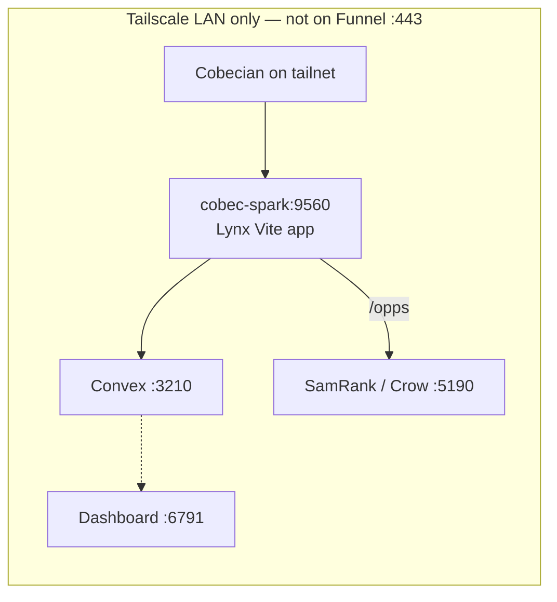

# Lynx

<p align="center">
  
</p>

**Lynx** is a procurement hub for government and public-sector sourcing. It gives teams a single place to browse and search **state and city procurement portals**—official websites and direct procurement links—so researchers, business developers, and proposal teams can find opportunities without hunting across dozens of bookmarks or spreadsheets.

The GitHub repo folder is `cobecium`; the product is **Lynx**. Open it on the Spark tailnet — **not** Funnel `:443`.

| | |
|---|---|
| **Open (Funnel)** | Not published — Spark LAN only |
| **Open (Spark)** | [http://cobec-spark:9560](http://cobec-spark:9560) · Convex [http://cobec-spark:3210](http://cobec-spark:3210) · dashboard [http://cobec-spark:6791](http://cobec-spark:6791) |
| **Auth** | Microsoft Entra → Convex JWT |
| **Stack** | React 18, Vite, Tailwind, Convex self-hosted, Bun |
| **Rebuild** | `docker compose --env-file .env.local up -d` from `/home/jmartinez/Projects/cobecium` |

Human docs are **HTML**: in-app [`/docs`](http://cobec-spark:9560/docs) and the same pages in [`public/docs/`](public/docs/). This README is the GitHub landing page.

---

## Who it’s for

- **Researchers and BD teams** who need fast access to state/city procurement links by location.
- **Capture / BD teams** ranking **federal SAM.gov opportunities** inside Lynx at **`/opps`** (CSV → SamRank embed/rank → Yes/No learning).
- **Admins** who maintain the link catalog, import bulk data, manage system prompts for AI-assisted “hunts,” and view analytics.
- **Organizations** that pair Lynx with an external **AI Orchestrator** (**HydraAlpha**) to run “hunts”: workflow runs (e.g. lead generation) scoped to a state, using configurable system prompts and optional RAG (e.g. AnythingLLM) or web search.

The main experience is a **procurement links grid** (by state/city) with search; **Opportunities** ranks federal notices from `samoutput/` CSVs via SamRank (Crow `:5190`); admins get **System prompts**, **Analytics**, and **Admin** (user/role management). Right-clicking a state card opens **Start Hunt** to launch an Orchestrator workflow with a state-specific prompt.

<p align="center">
  
</p>

<p align="center"><em>State / city portal grid — the home surface at <code>/app</code>.</em></p>

---

## Where it runs

**Not on Funnel. Tailscale LAN only.** Cobecians on the tailnet hit Spark `:9560`. There is no Funnel `:443` path for Lynx — do not invent one.



| Piece | Address | Notes |
|-------|---------|--------|
| Lynx app | [http://cobec-spark:9560](http://cobec-spark:9560) | Vite SPA (Docker `app`) |
| Convex backend | [http://cobec-spark:3210](http://cobec-spark:3210) | Self-hosted queries / mutations / actions |
| Convex dashboard | [http://cobec-spark:6791](http://cobec-spark:6791) | Inspect tables, run functions |
| Opportunities | [http://cobec-spark:9560/opps](http://cobec-spark:9560/opps) | Proxies SamRank |
| HTML docs | [http://cobec-spark:9560/docs](http://cobec-spark:9560/docs) | In-app; also [`public/docs/`](public/docs/) |

Start / refresh the released unit:

```bash
cd /home/jmartinez/Projects/cobecium
docker compose --env-file .env.local up -d
```

Need a new image (Dockerfile change)? add `--build`. Do not bind a second process on `:9560`. Do not `tailscale funnel reset`.

---

## Opportunities, hunts, siblings

| Surface | What |
|---------|------|
| **`/` · `/app`** | State/city procurement grid + search |
| **`/opps`** (+ `/opps/approved`, `/opps/status`) | Federal SAM feed via **Crow / SamRank** on [http://cobec-spark:5190](http://cobec-spark:5190) |
| **Start Hunt** | HydraAlpha orchestrator workflows, scoped to a state |
| **`/feedback`** | Feature / bug reports (list + detail) |
| **`/system-prompts` · `/analytics` · `/admin`** | Admin-only (Convex `requireAdmin`) |
| **`/docs`** | HTML docs index |

Related Cobec pieces (not this repo):

- **Crow / SamRank** (`:5190`) — ranking, embeddings, Yes/No learning that `/opps` embeds.
- **HydraAlpha** — orchestrator hunts launched from a state card.
- **MuniOpps** — municipal CSV scrape that feeds the portal catalog.
- **Lynx.Enterprise** — .NET / Teams sibling (Entra + PostgreSQL), same product idea on a different stack.

<p align="center">
  
</p>

<p align="center">
  
</p>

<p align="center"><em>In-app feedback list and detail (<code>/feedback</code>).</em></p>

---

## Tech stack

| Layer | Technology |
|-------|------------|
| **Frontend** | React 18, React Router 7, Vite 6, TypeScript 5.6 |
| **Styling** | Tailwind CSS 3, Radix UI (Dialog, Label, Slot), CVA, `clsx` / `tailwind-merge` |
| **Auth** | Microsoft Entra ID (MSAL) → Convex JWT; identity synced to `lynxUsers.externalId` (oid) |
| **Backend / DB** | Convex (queries, mutations, actions); self-hosted in Docker on Spark |
| **Runtime** | Bun (scripts + container); `concurrently` for local `vite` + `convex dev` |

Convex is the API and persistence (`procurementLinks`, `chatSystemPrompts`, `lynxUsers`, `huntStarts`, `orchestratorDocsSync`, etc.). Opportunities go through Convex `api.samRank.*` actions that proxy SamRank. Hunts go through `api.orchestrator.createWorkflow`. See [`public/docs/integration.html`](public/docs/integration.html) and [`public/docs/opportunities-integration.html`](public/docs/opportunities-integration.html).

---

## Architecture overview

- **App (Vite)** — SPA on **`:9560`** (Docker) or `5173` if you run Vite bare; `@/` alias points at `src/`. Uses `MsalProvider` + `ConvexProviderWithAuth`; `useStoreUserEffect` syncs Entra identity into Convex `lynxUsers`.
- **Convex** — Self-hosted Docker: backend `:3210` + dashboard `:6791` + app container that runs `convex dev` + Vite. Do not set `CONVEX_DEPLOYMENT` when `CONVEX_SELF_HOSTED_*` is set. See [`public/docs/convex-local-setup.html`](public/docs/convex-local-setup.html).
- **Routes** — `/` / `/app` = procurement grid; `/opps` = federal Opportunities; `/system-prompts`, `/analytics`, `/admin` are admin-only (`AdminOnlyRoute` + Convex `requireAdmin`). Style demos live at `/1`–`/10`.
- **Data flow** — Grid reads `api.procurementLinks.list` and `api.systemPrompts.list`. Opportunities read `api.samRank.*`. Admins import JSON, add/edit links, and edit prompts. “Start Hunt” uses the orchestrator actions and `HuntChatModal`.
- **Orchestrator docs sync** — Convex can fetch and hash HydraAlpha API docs; the header flags when stored docs have changed (`convex/orchestratorDocsSync.ts`).

---

## Developer conventions

- **Path alias** — Use `@/` for `src/` (e.g. `@/components/LynxHeader`). Configured in `tsconfig.json` and `vite.config.ts`.
- **Convex** — Backend lives in `convex/`. Do not edit `convex/_generated/*` by hand. Self-hosted notes: [`public/docs/convex-cli-login.html`](public/docs/convex-cli-login.html) and [AGENTS.md](AGENTS.md).
- **Auth and roles** — Convex validates Entra tokens via `auth.config.ts`. Roles (`admin` / `user`) live in `lynxUsers`; first admin via `LYNX_FIRST_ADMIN_OID`. See [`public/docs/auth-and-admin-setup.html`](public/docs/auth-and-admin-setup.html).
- **UI** — Shared components under `src/components/` (including `ui/`). Prefer Tailwind and existing tokens (`primary`, `accent`, `--base-orange`, `--base-teal`).
- **Strict TypeScript** — `strict`, `noUnusedLocals`, `noUnusedParameters`, `noUncheckedIndexedAccess`. Convex types come from `convex/_generated`.
- **Scripts** — `bun run dev` runs Vite + Convex concurrently (local). Container start is `start.sh` (convex dev + Vite on `:9560`). Build: `bun run build`; HTML docs: `bun run docs:html`.

---

## Docs

Open [http://cobec-spark:9560/docs](http://cobec-spark:9560/docs) while the app is up, or the files in [`public/docs/`](public/docs/) from this repo. Regenerate with `bun run docs:html` after Markdown source changes.

| HTML | Purpose |
|------|---------|
| [`public/docs/readme.html`](public/docs/readme.html) | This page, converted for in-app `/docs/readme` |
| [`public/docs/opportunities-integration.html`](public/docs/opportunities-integration.html) | Lynx ↔ SamRank `/opps` (routes, env, enrich) |
| [`public/docs/sam-opportunity-ranking-agent.html`](public/docs/sam-opportunity-ranking-agent.html) | CSV → embed → rank agent brief |
| [`public/docs/convex-local-setup.html`](public/docs/convex-local-setup.html) | Self-hosted Convex Docker |
| [`public/docs/convex-cli-login.html`](public/docs/convex-cli-login.html) | Convex CLI / self-hosted vs cloud |
| [`public/docs/auth-and-admin-setup.html`](public/docs/auth-and-admin-setup.html) | Entra + first-admin |
| [`public/docs/integration.html`](public/docs/integration.html) | Orchestrator / hunt workflow API |
| [AGENTS.md](AGENTS.md) | Notes for AI agents (Opportunities + Convex) |
